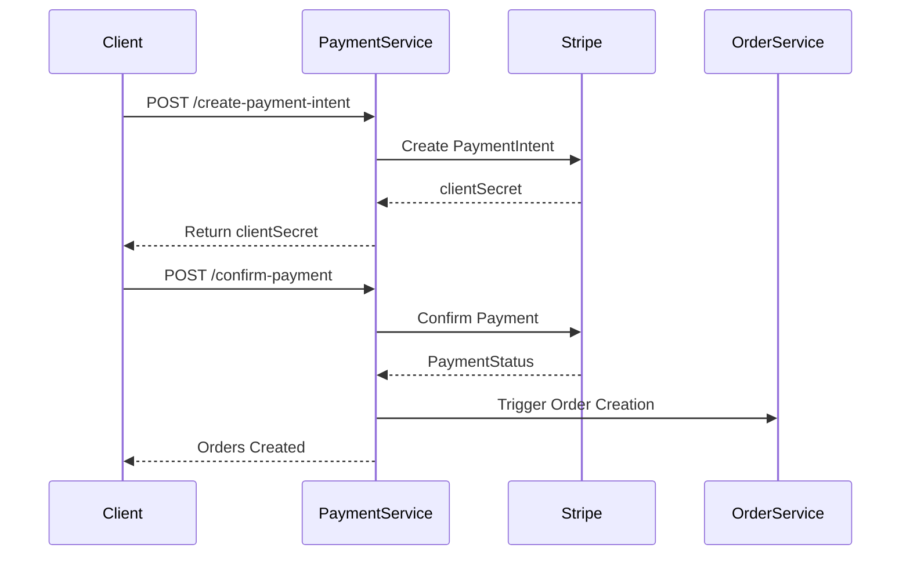

# 💳 payment-service API Overview

This service manages secure payment processing through the Stripe API. It supports one-time and reusable payments and coordinates with the order-service upon successful transactions.

## 📍 Base URL
```
/payment
```

---

## 📌 API Endpoints

### 1. POST `/create-payment-intent`
**Create a PaymentIntent in Stripe and return the client secret.**

📦 **Request Body**
```json
{
  "consumerId": "u123",
  "cartItems": [
    { "productId": "p001", "vendorId": "v101", "quantity": 2 },
    { "productId": "p002", "vendorId": "v102", "quantity": 1 }
  ],
  "totalAmount": 59.97,
  "currency": "CAD",
  "paymentMethodId": "pm_123",
  "useSavedMethod": true,
  "savePaymentMethod": true
}
```

✅ **Response: 200 OK**
```json
{
  "clientSecret": "secret_abc123",
  "message": "Payment intent created successfully."
}
```

---

### 2. POST `/confirm-payment`
**Confirm Stripe payment and trigger order creation.**

📦 **Request Body**
```json
{
  "consumerId": "u123",
  "paymentId": "pi_abc123",
  "paymentStatus": "succeeded",
  "cartItems": [ ... ],
  "shippingAddress": {
    "line1": "123 Main St",
    "city": "Halifax",
    "postalCode": "B3H 1Y4",
    "country": "CA"
  }
}
```

✅ **Response: 201 Created**
```json
{
  "message": "Payment confirmed and orders created."
}
```

---

### 3. GET `/methods/:consumerId`
**Fetch saved payment methods for the consumer.**

✅ **Response: 200 OK**
```json
[
  {
    "paymentMethodId": "pm_abc123",
    "type": "card",
    "brand": "visa",
    "last4": "4242"
  }
]
```

---

## ❌ Error Handling

🧱 **Standard Format**
```json
{
  "error": "Error message here"
}
```

❌ **Common Errors**
- 400 Bad Request: Invalid or missing fields
- 402 Payment Required: Stripe payment failed
- 404 Not Found: Consumer or payment method not found
- 500 Internal Server Error: Stripe API failure

---

## ✅ Scope Coverage Summary



📌 **Features Covered**
# 💳 payment-service API Overview

This service manages secure payment processing through the Stripe API. It supports one-time and reusable payments and coordinates with the order-service upon successful transactions.

## 📍 Base URL
```
/payment
```

---

## 📌 API Endpoints

### 1. POST `/create-payment-intent`
**Create a PaymentIntent in Stripe and return the client secret.**

📦 **Request Body**
```json
{
  "consumerId": "u123",
  "cartItems": [
    { "productId": "p001", "vendorId": "v101", "quantity": 2 },
    { "productId": "p002", "vendorId": "v102", "quantity": 1 }
  ],
  "totalAmount": 59.97,
  "currency": "CAD",
  "paymentMethodId": "pm_123",
  "useSavedMethod": true,
  "savePaymentMethod": true
}
```

✅ **Response: 200 OK**
```json
{
  "clientSecret": "secret_abc123",
  "message": "Payment intent created successfully."
}
```

---

### 2. POST `/confirm-payment`
**Confirm Stripe payment and trigger order creation.**

📦 **Request Body**
```json
{
  "consumerId": "u123",
  "paymentId": "pi_abc123",
  "paymentStatus": "succeeded",
  "cartItems": [ ... ],
  "shippingAddress": {
    "line1": "123 Main St",
    "city": "Halifax",
    "postalCode": "B3H 1Y4",
    "country": "CA"
  }
}
```

✅ **Response: 201 Created**
```json
{
  "message": "Payment confirmed and orders created."
}
```

---

### 3. GET `/methods/:consumerId`
**Fetch saved payment methods for the consumer.**

✅ **Response: 200 OK**
```json
[
  {
    "paymentMethodId": "pm_abc123",
    "type": "card",
    "brand": "visa",
    "last4": "4242"
  }
]
```

---

## ❌ Error Handling

🧱 **Standard Format**
```json
{
  "error": "Error message here"
}
```

❌ **Common Errors**
- 400 Bad Request: Invalid or missing fields
- 402 Payment Required: Stripe payment failed
- 404 Not Found: Consumer or payment method not found
- 500 Internal Server Error: Stripe API failure

---

## ✅ Scope Coverage Summary


📌 **Features Covered**

✔ Secure Payments:
- Integrates with Stripe for PaymentIntent flow
- Supports card saving, re-use, and auto-confirmation

✔ Checkout Integration:
- Receives cart and shipping info
- Confirms payment and triggers order creation

✔ Saved Payment Methods:
- Consumers can save and reuse cards via Stripe

✔ Fields Supported:
- consumerId, cartItems, totalAmount, currency, paymentMethodId, useSavedMethod, savePaymentMethod

