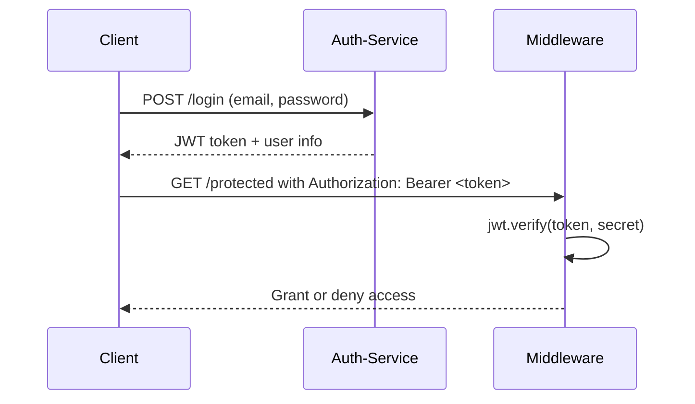

# ShopSphere

# 🔐 auth-service API Overview

This microservice manages user authentication and authorization for the e-commerce platform.

## 📍 Base URL
```
/auth
```

---

## 📌 API Endpoints

### 1. POST `/register`
**Registers a new user.**

**Request Body**
```json
{
  "username": "abdullah123",
  "email": "abdullah@example.com",
  "password": "strongPassword!",
  "role": "consumer"
}
```

**Response: 201 Created**
```json
{
  "message": "User registered successfully.",
  "user": {
    "userId": "u123",
    "username": "abdullah123",
    "email": "abdullah@example.com",
    "role": "consumer"
  }
}
```

---

### 2. POST `/login`
**Authenticates the user and returns a JWT token.**

**Request Body**
```json
{
  "email": "abdullah@example.com",
  "password": "strongPassword!"
}
```

**Response: 200 OK**
```json
{
  "token": "jwt.token.here",
  "user": {
    "userId": "u123",
    "username": "abdullah123",
    "role": "consumer"
  }
}
```

---

### 3. GET `/me`
**Returns the authenticated user's full profile.**

**Headers**
```
Authorization: Bearer <token>
```

**Response: 200 OK**
```json
{
  "userId": "u123",
  "username": "abdullah123",
  "email": "abdullah@example.com",
  "role": "consumer"
}
```

---

### 4. GET `/validate`
**Validates the JWT token and returns basic identity.**

**Headers**
```
Authorization: Bearer <token>
```

**Response: 200 OK**
```json
{
  "valid": true,
  "userId": "u123",
  "role": "vendor"
}
```

---

## 🔐 JWT Authentication Flow



---

## ❌ Error Handling

**Error Format**
```json
{
  "error": "Error message here"
}
```

**Common Errors**

- `/register`:
  - `400 Bad Request`: Missing fields
  - `409 Conflict`: Email exists

- `/login`:
  - `401 Unauthorized`: Invalid credentials

- `/me` & `/validate`:
  - `401 Unauthorized`: Missing/invalid/expired token
